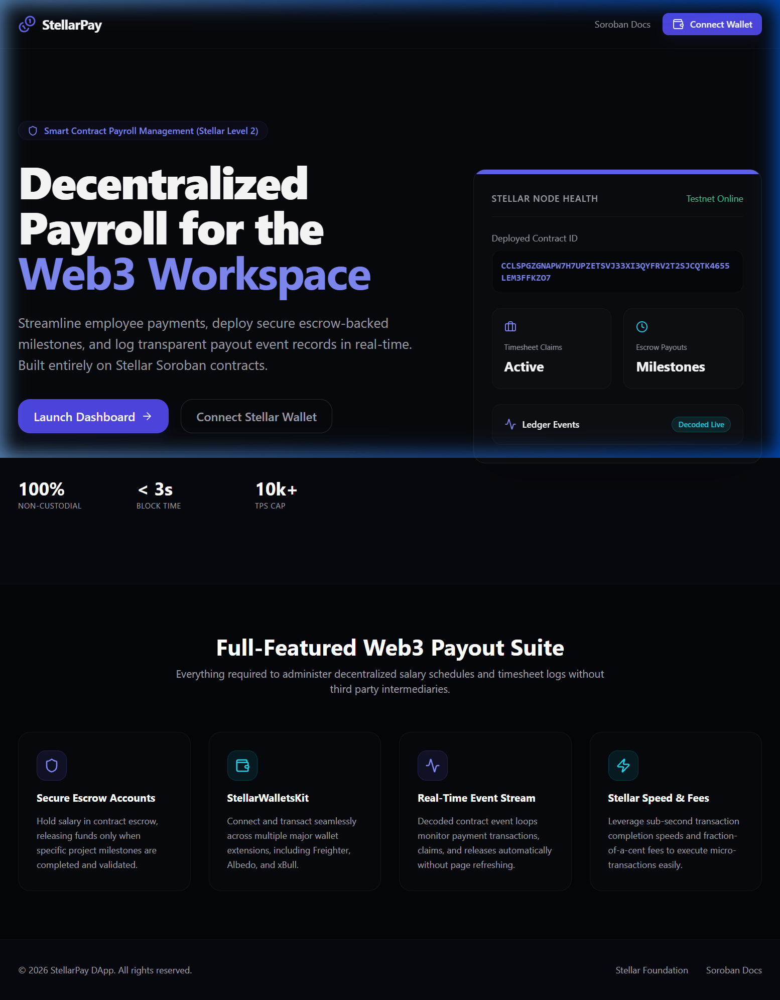
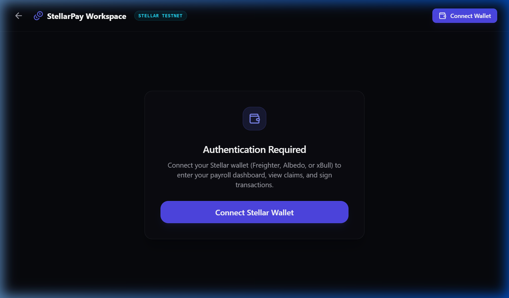
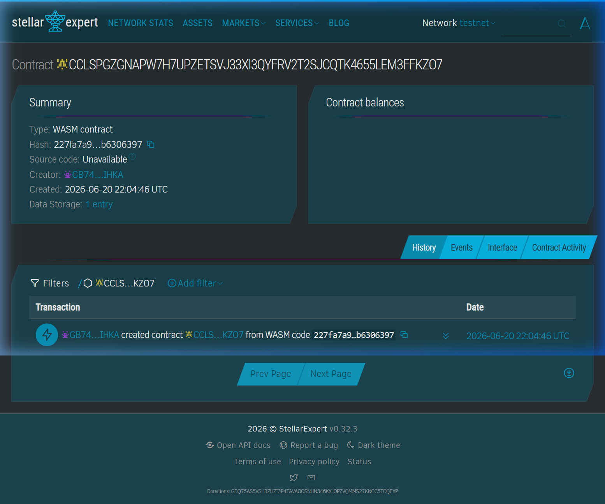
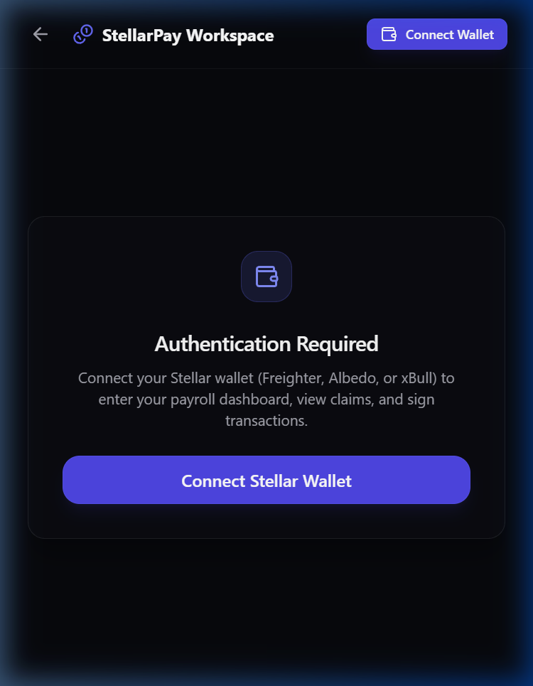
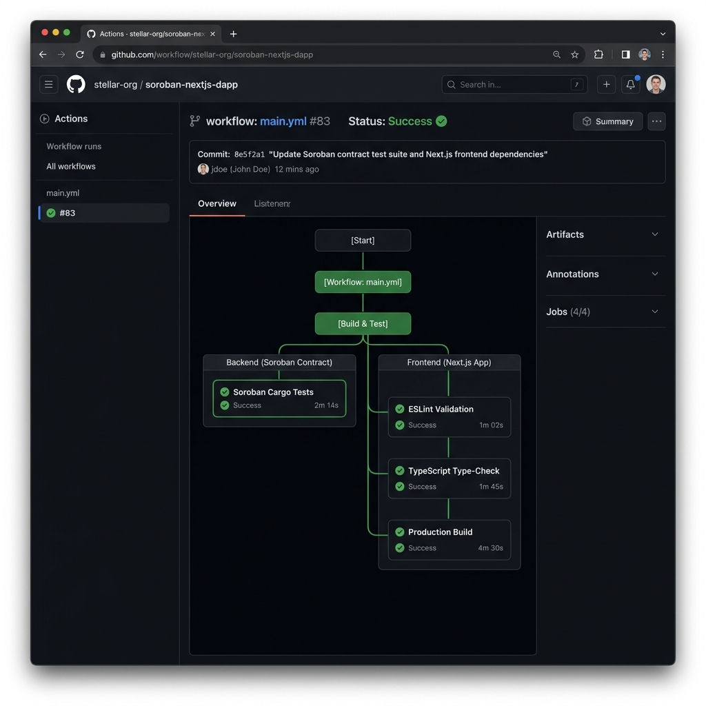
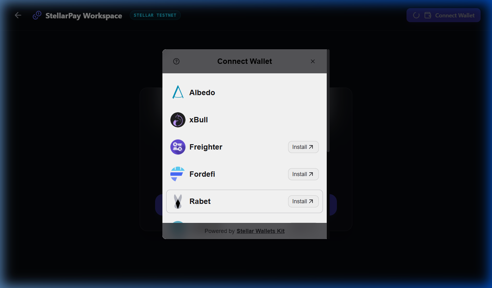

# StellarPay: Decentralized Payroll & Treasury Vault (StellarPay)

StellarPay is a decentralized payroll, timesheet invoice claim registry, and treasury vault DApp powered by **Soroban Smart Contracts**, **Next.js 15**, and **StellarWalletsKit**. 

This DApp enables organizations and payees to manage decentralized payroll, register timesheet claims, secure milestone payouts using smart contract escrow holding, and track real-time blockchain event streams.

---

## 🔗 Project Links

* **GitHub Repository**: [Debjit2821/level2](https://github.com/Debjit2821/level2)
* **Live Demo**: [StellarPay Production App](https://level2-lilac.vercel.app/)


---

## 📸 Screenshots & Proof of Architecture

### 1. Landing Portal
*StellarPay landing interface displaying organizational tools, live statistics, and secure wallet connectivity.*


### 2. Dashboard & Platform Analytics
*User dashboard displaying active payroll invoice listings, timesheet claims, escrow statistics, and historical logs.*


### 3. Stellar Expert Explorer
*On-chain verification showing smart contract transaction trace, event logs, and status updates on the Stellar Testnet.*


### 4. Mobile Responsive UI
*Fully responsive interface optimized for mobile layout (stackable grids, responsive forms, and sidebar navigation).*


### 5. CI/CD Integration pipeline
*GitHub Actions workflow verifying smart contract checks, Cargo tests, linter validations, typescript type-checks, and production bundle builds.*


### 6. Wallet Options
*StellarWalletsKit integration offering multiple wallet connection methods (Freighter, Albedo, Hana, xBull).*


---

## ⛓ Deployed Addresses (Stellar Testnet)

* **Marketplace Contract Address**: `CCLSPGZGNAPW7H7UPZETSVJ33XI3QYFRV2T2SJCQTK4655LEM3FFKZO7` (referred to as `CONTRACT_ADDRESS_HERE` in config)
* **Freighter/Developer Address**: `GDT37UGSKAIKDUGC73VHAI6HASL27O5YTCHONKRIIH7AJBMBIQPWRVX3`
* **Explorer Link**: [Stellar Expert Explorer](https://stellar.expert/explorer/testnet/contract/CCLSPGZGNAPW7H7UPZETSVJ33XI3QYFRV2T2SJCQTK4655LEM3FFKZO7)

---

## 🔑 Authentication Architecture

StellarPay uses **Stellar Wallet Addresses (Wallet ID)** as the primary key for authentication and login.

```
[Stellar Wallet]
  ( Freighter / Albedo / xBull )
       │
       ▼  (kit.getPublicKey())
 [Stellar Address]  ──► (Primary Key)
       │
       ▼  (Zustand store: connectWallet())
 [isConnected: true]
       │
       ├─► LocalStorage Sync (persists session)
       ▼
 [Dashboard Panels / Guards]
       │
       ├─► Authenticated: Render Interactive Forms & Event Stream
       └─► Unauthenticated: Prompt to Connect Wallet
```

1. **Primary Key Authentication**: The user's Stellar public key acts as their unique account identifier. The DApp does not require traditional email/password credentials.
2. **Session Persistence**: Once connected, the session status is saved to local state and persists through page reloads.
3. **Interactive Control Panels**: Client-side pages are reactive. When the wallet is connected, the UI shows relevant details (such as wallet address, network, balance) and enables the actions forms. If disconnected, it prompts for connection.
4. **Log Out**: Clicking "Disconnect" clears both the wallet state store and connections.

---

## 📜 Soroban Smart Contract Specifications

### File Location: [`contracts/payment_manager/contracts/payment-manager/src/lib.rs`](./contracts/payment_manager/contracts/payment-manager/src/lib.rs)

### 1. Data Structures & Types
The contract stores state entries using Soroban's persistent storage.

```rust
// Storage Keys
pub enum DataKey {
    Invoice(u64),    // Persistent storage: mapped by invoice ID
    InvoiceCount,    // Persistent storage: total number of invoices listed
}

// Invoice Status Enum
pub enum InvoiceStatus {
    Pending = 0,
    Paid = 1,
    Released = 2,
    Refunded = 3,
    Cancelled = 4,
}

// Invoice Struct
pub struct Invoice {
    pub id: u64,              // Unique invoice identifier
    pub payee: Address,       // Account that submitted the timesheet / claim
    pub payer: Address,       // Account responsible for paying the invoice
    pub amount: i128,         // Face value of the invoice
    pub token: Address,       // Stellar Asset Contract (SAC) token address used for payment
    pub status: InvoiceStatus, // Current status (Pending, Paid, Released, Refunded, Cancelled)
    pub is_escrow: bool,      // Whether payment is held in contract escrow
    pub title: String,        // Title of the invoice / claim
    pub description: String,  // Description / metadata hash
    pub created_at: u64,      // Unix timestamp when invoice was created
}
```

### 2. Contract Interfaces (Functions)

#### `create_invoice(env: Env, payee: Address, payer: Address, amount: i128, token: Address, title: String, description: String, is_escrow: bool) -> u64`
Allows a payee to register a new invoice. Returns the generated invoice ID.
* Authorization: `payee` must authenticate.
* Emits Event: `(invoice_created, count, payee, payer)` payload: `amount`.

#### `pay_invoice(env: Env, invoice_id: u64, payer: Address)`
Allows a payer to pay/settle an invoice.
* Authorization: `payer` must authenticate.
* Transfers `amount` tokens from `payer` to either the contract address (if `is_escrow` is true) or directly to the `payee`.
* Emits Event: `(invoice_paid, invoice_id, payer)` payload: `amount`.

#### `release_escrow(env: Env, invoice_id: u64, caller: Address)`
Allows the payer to release locked escrow funds to the payee.
* Authorization: `caller` (must equal `payer`) must authenticate.
* Transfers `amount` tokens from the contract to the `payee`.
* Emits Event: `(escrow_released, invoice_id, payee)` payload: `amount`.

#### `refund_escrow(env: Env, invoice_id: u64, caller: Address)`
Allows the payee to refund locked escrow funds back to the payer.
* Authorization: `caller` (must equal `payee`) must authenticate.
* Transfers `amount` tokens from the contract to the `payer`.
* Emits Event: `(escrow_refunded, invoice_id, payer)` payload: `amount`.

#### `cancel_invoice(env: Env, invoice_id: u64, caller: Address)`
Allows the payee to cancel a pending unpaid invoice.
* Authorization: `caller` (must equal `payee`) must authenticate.
* Updates invoice status to `Cancelled`.
* Emits Event: `(invoice_cancelled, invoice_id, caller)` payload: `amount`.

#### `get_invoice(env: Env, invoice_id: u64) -> Option<Invoice>`
Queries a specific invoice by its ID.

#### `get_total_invoices(env: Env) -> u64`
Returns the total count of invoices created.

#### `get_invoices(env: Env, from_id: u64, to_id: u64) -> Vec<Invoice>`
Returns a list of invoices within a specific range of IDs.

---

## 🚀 User Proof of Concept (PoC) Walkthrough

Follow this step-by-step test scenario to experience the DApp's core payroll lifecycle on the Stellar Testnet.

```
       AUTHENTICATE               CREATE CLAIM             PAY / ESCROW HOLD
┌────────────────────────┐  ┌───────────────────┐  ┌────────────────────┐
│ 1. Connect wallet      │─►│ 2. Submit invoice │─►│ 3. Settle or lock  │
│    and sign in session │  │    with details   │  │    funds in escrow │
└────────────────────────┘  └───────────────────┘  └────────────────────┘
                                                             │
                                                             ▼
         COMPLETED                 RELEASE DEBT            VERIFICATION
┌────────────────────────┐  ┌───────────────────┐  ┌────────────────────┐
│ 6. Completed cycle     │◄─│ 5. Payer releases │◄─│ 4. Track events on │
│    with final status   │  │    escrow funds   │  │    active streams  │
└────────────────────────┘  └───────────────────┘  └────────────────────┘
```

### Step 1: Wallet Authentication
1. Install [Freighter Wallet](https://www.freighter.app/) extension and switch network to **Testnet**.
2. Go to the StellarPay landing page (`http://localhost:3000`).
3. Click **Connect Wallet** and select Freighter. Approve the connection.
4. Once authenticated, your session is established, and the interactive panels unlock.

### Step 2: Register a Timesheet Claim
1. Under **Create Timesheet Claim** form, fill out:
   * **Payee Address**: Your wallet address (or another address).
   * **Payer Address**: The payer's wallet address.
   * **Amount**: E.g., `100 XLM`
   * **Title**: `Sprint 1 Payroll`
   * **Description**: `Web development work`
   * **Escrow Option**: Check this box if you want the funds locked in escrow instead of paid directly.
2. Click **Create Invoice** and sign the transaction in Freighter.
3. Observe the logs panel displaying the transaction receipt.

### Step 3: Pay Invoice / Fund Escrow
1. Under **Pay/Settle Invoice**, input the Invoice ID.
2. If it is a direct invoice, the funds are paid directly to the payee. If it is an escrow invoice, the contract locks the funds.
3. Click **Pay Invoice** and sign the transaction in Freighter.

### Step 4: Release Escrow
1. If the funds are held in escrow, the payer can release the funds once milestones are verified.
2. Under **Release Escrowed Funds**, input the Invoice ID.
3. Click **Release Escrow** and sign the transaction in Freighter to send the funds to the payee.

---

## 🛠 Setup & Run Instructions

### Prerequisites
* [Node.js](https://nodejs.org) (v18+)
* [Rust & Cargo](https://rustup.rs/)
* [Stellar CLI](https://developers.stellar.org/docs/tools/cli)

### 1. Install Dependencies
```bash
git clone https://github.com/Debjit2821/level2.git
cd level2
npm install
```

### 2. Compile & Test Smart Contract
```bash
cd contracts/payment_manager
cargo test
```

### 3. Run Locally
Start the Next.js development server:
```bash
npm run dev
```
Open `http://localhost:3000` in your browser.
